# AI-QSAR
The project is a software for QSAR prediction and SMILES design by deep learning. 

### Environment
Tested on python3.6(conda virtual environment)

### Requirements
You have to install a valid version of **rdkit**. For python3.6 in conda virtual environment, you can install with `conda install conda-forge::rdkit`. To create a conda virtual enviroment for python3.6, run `conda create --name py36 python=3.6` and use `source activate py36` and `source deactivate py36` to activate and deactivate the virtual environment.

For other packages, see `requirements.txt` and run `pip install -r requirement.txt`

### Run
Enter folder `QSAR-GUI` and run `python main.py`

### GUI Description
The name of the GUI is **PyMolPredictor**. The window of the GUI has 3 parts: a menubar on the top, a toolbar below the menubar, and the main window under the memubar. The menubar consists of various kinds of operations. The toolbar is made up of shortcuts of operations in the menubar. The main window is the main part for loading data and model, making prediction and design, output and save model and so on. In the main window, there are 4 tabs: Data Processing, Model Training, Result Analysis, Activity Prediction, and Model Design.

#### Menubar
<!--  -->
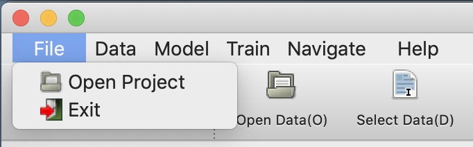

+ Open Project: Browse and select the project's folder. Data folders in all main window's tabs will also be set to the project folder.

+ Exit: Exit the GUI.

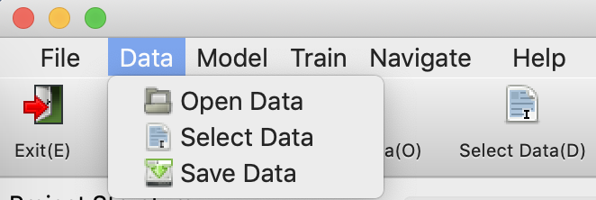

+ Open Data: Browse and select the data folder of the current tab.

+ Select Data: Select the currently highlighted data of the current tab.

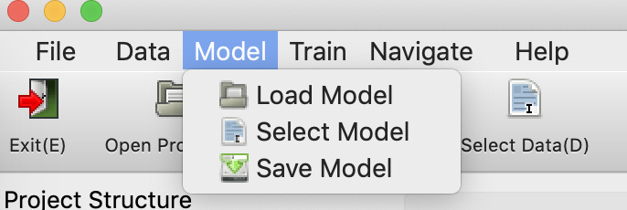

+ Load Model: Browse and load a model file in the current tab.

+ Select model: Select the currently highlighted model in the model list of the current tab.

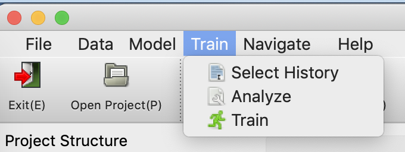

+ Select History: Select a training history file from the training history folder in "Result Analysis" tab.

+ Analyze: Trigger the "Analyze" or "Design" pushButton to make some analysis in the current tab.

+ Train: Trigger the "Train" pushButton to start training models in the current tab.

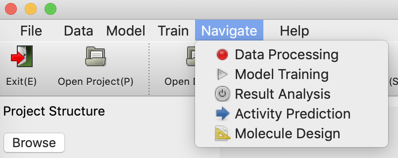

+ Data Processing: Switch to "Data Processing" tab.
+ Model Training: Switch to "Model Training" tab.
+ Result Analysis: Switch to "Result Analysis" tab.
+ Molecule Design: Switch to "Molecule Design" tab.

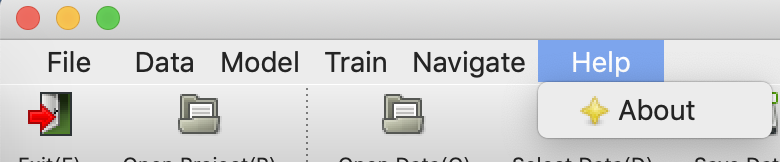

+ About: Not Implemented yet.

#### Main Window: Data Processing
This tab is used for preposessing and output .csv data for input of other tabs.

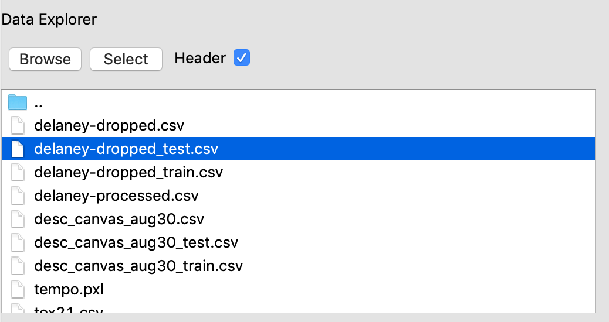

Browse and Select Data: 
+ Browse: Set the current data folder.
+ Select(or double click): Select the highlighted data file in the current data folder.
+ Header: If "Header" is checked, then the first row of the csv file is used as column names; otherwise, the column name is automatically generated.

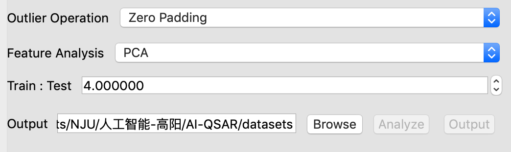

Data Preprocessing:
+ Outlier Operation: Select a missing value operation. 
+ Feature Analysis: Select a dimension reduction method to reduce dimention of features in the data, and plot them in a 2-d plane.
+ Train : Test: The ratio of length of trainset to length of testset. Split the selected dataset into trainset and testset according to the given ratio.
+ Browse: Set the output folder of preprocessed and splitted trainset and testset.
+ Analyze: Analyzing the original and transformed dataset, and show on the right panel.
+ Output: Output the transformed trainset and testset to the output folder.

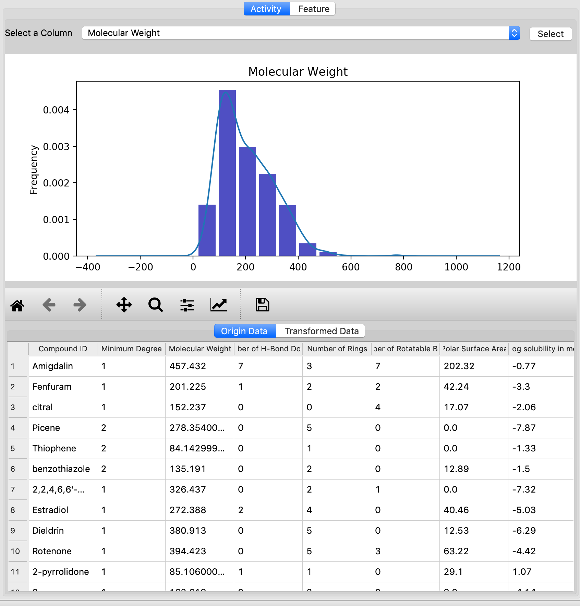

Analysis Result:
+ Activity: The upper panel is used to plot the distribution of the selected column. The lower panel shows the first 100 rows of Original Data and Transformed Data.
    + Select: Select a feature column and plot its distribution.
    + Origin Data: Switch to the Original Data's table
    + Transformed Data: Switch to the Transformed Data's table
+ Feature: This panel shows the 2-D plot of features after dimension reduction by PCA or SVD.

#### Main Window: Model Training
This tab is used for training QSAR model.

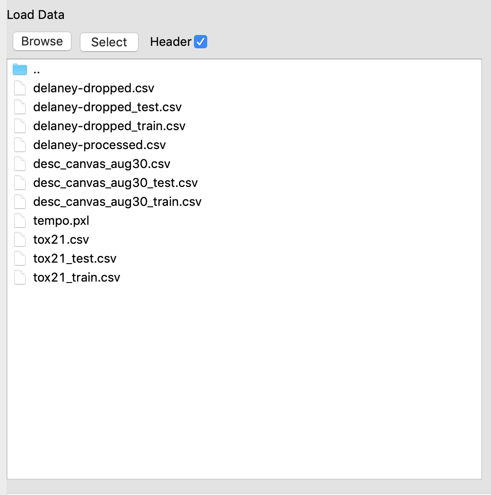

Browse and Select Data: 
+ Browse: Set the current data folder.
+ Select(or double click): Select the highlighted data file in the current data folder.
+ Header: If "Header" is checked, then the first row of the csv file is used as column names; otherwise, the column name is automatically generated.

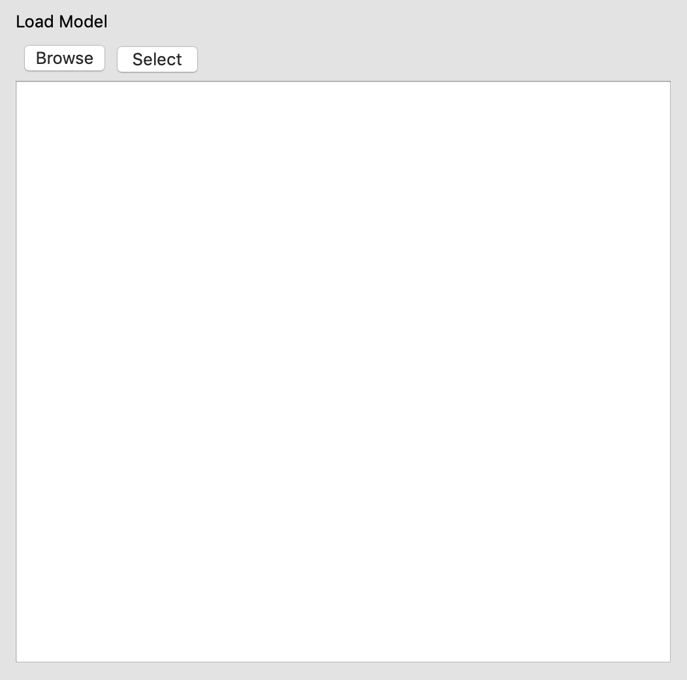

Browse and Select Model: 
+ Browse: Browse and add a model file to the model list.
+ Select(or double click): Select the highlighted model file in the current model list.

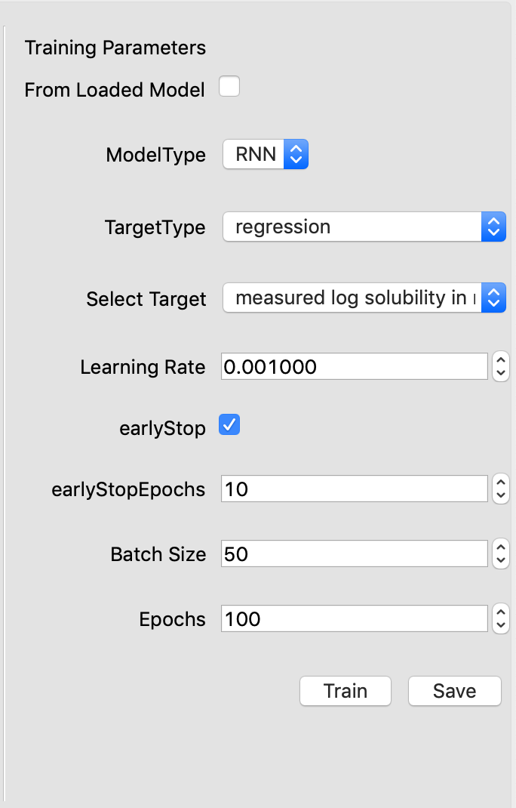

Training Parameters:
+ From Loaded Model: If it is checked, training will start from the loaded model. 
+ TargetType: Whether to train regression model or classification model. Only support regression currently.
+ Select Target: Select the target feature of training.
+ Learning Rate: Step size of Gradient Descent in the training process.
+ earlyStop: If it is checked, training will stop when the loss doesn't go down in **earlyStopEpochs** epochs. 
+ earlyStopEpochs: Set the epoch limit of earlyStop.
+ Batch Size: Size of training batch of Stochastic Gradient Descent in the training process.
+ Epochs: Maximum epochs of training.
+ Train: Start training model with all training parameters above.
+ Save: Browse and save the trained model.

#### Main Window: Result Analysis
This tab is used for analysing trained QSAR model.

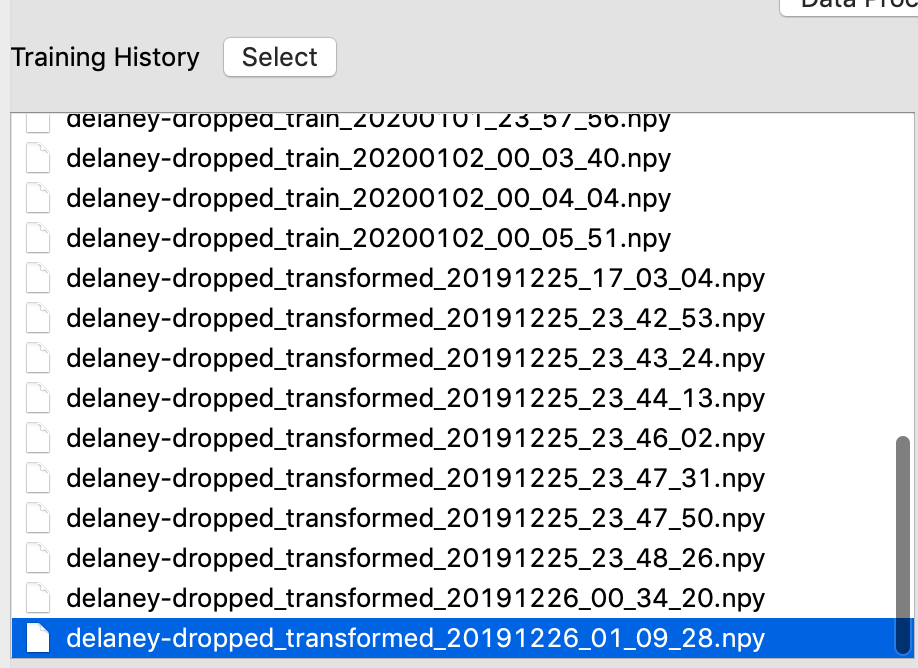

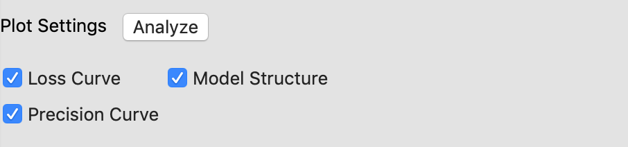

#### Main Window: Activity Prediction
This tab is used for predicting QSAR on test datasets, plotting predicted molecule structure, and plot fitting curve.

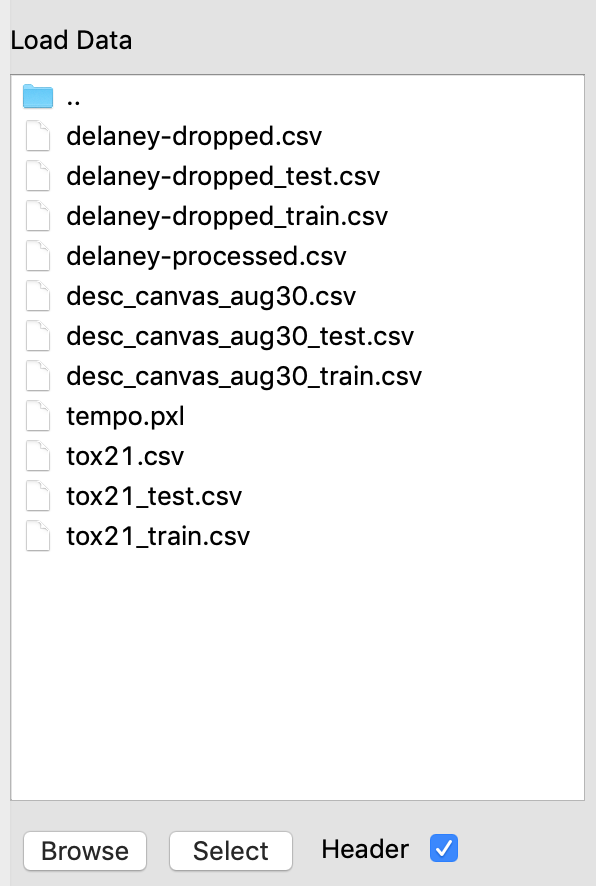

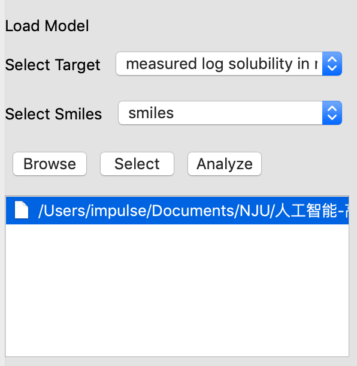

#### Main Window: Model Design
This tab is used for training and analyzing VAE model to design molecules.

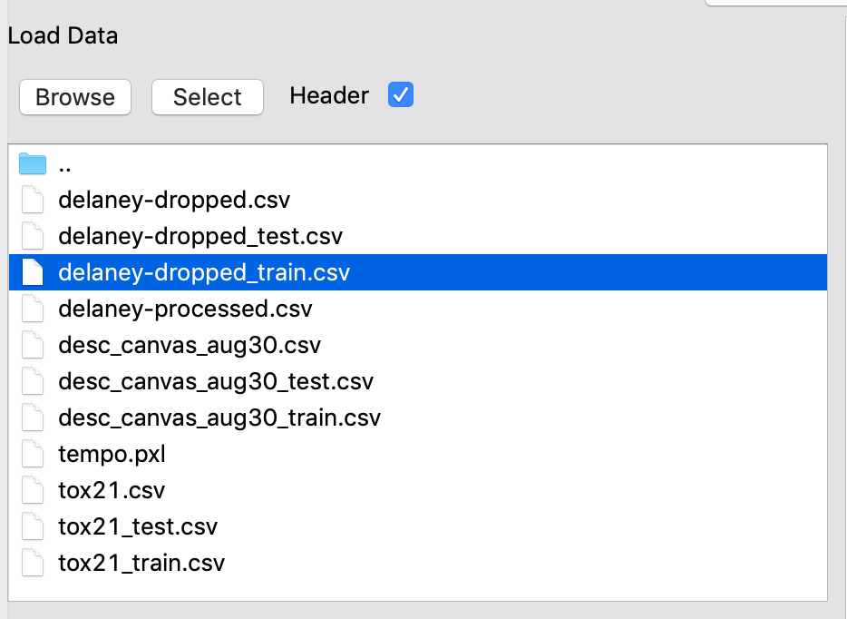

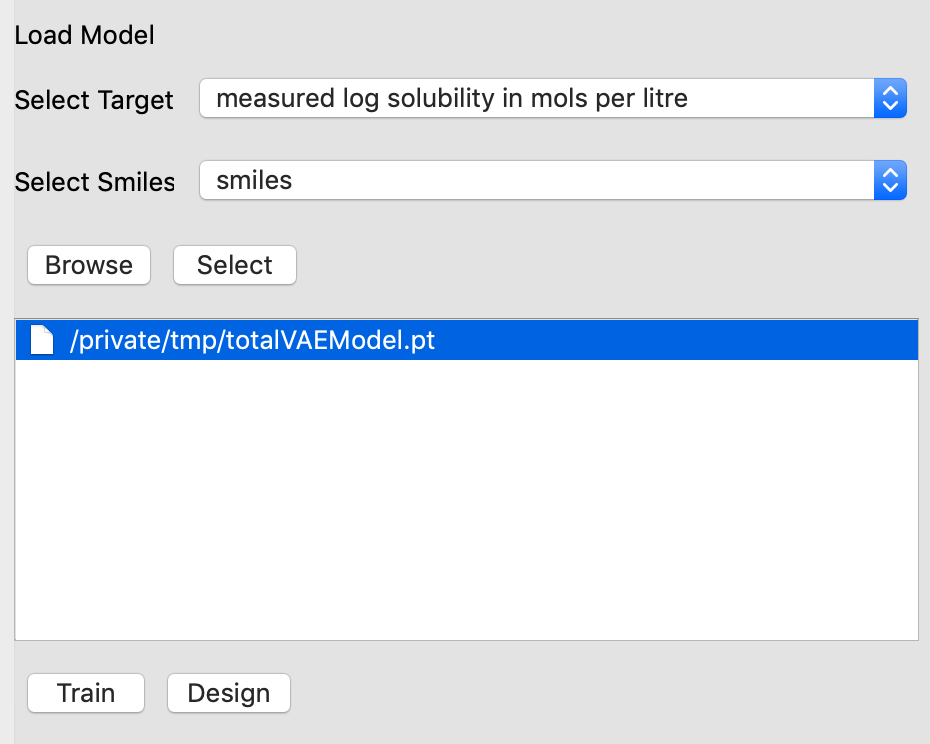
